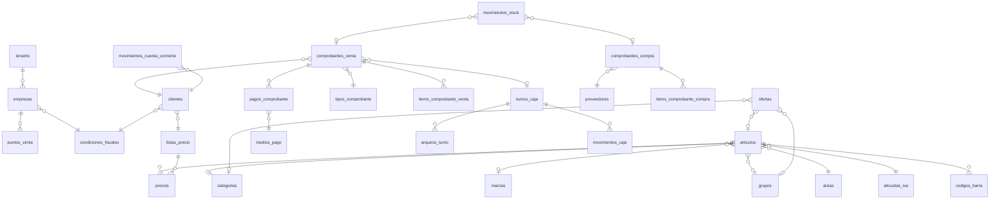

# 10 — Modelo de datos normalizado

> Reemplaza el schema propuesto en el [doc 03](03-modelo-destino-postgres.md). El doc 03
> sigue siendo la referencia del **mapeo legacy → destino** para la migración de datos;
> este documento define el modelo definitivo del producto, pensado para venderse a
> terceros. Todo se define acá de entrada, aunque se implemente por etapas (ver final).

## Principios

1. **Scoping según doc 09.** Toda tabla declara su categoría: catálogo
   (`id_tenant` + `id_empresa NULL`), operativa (`id_tenant` + `id_punto_venta`)
   o global. En los SQL de abajo el scoping se indica con `-- [catálogo]`,
   `-- [operativa]`, `-- [global]` y no se repite en cada columna.
2. **Convención de nombres del doc 03** (castellano, `snake_case`, plural,
   `items_x`, `movimientos_x`) con la forma de PK del doc 08: `id_articulo`, no
   `articulo_id`.
3. **`EntidadBase`**: `created_at`, `updated_at`, `deleted_at` (soft delete con
   unique parciales `WHERE deleted_at IS NULL`) en todas las tablas.
4. **Los padrones son datos, no enums.** El legacy murió por `tipo=95` y `c1..c6`.
   Enum nativo de Postgres solo para estados de máquina de estados (`estado_turno`);
   catálogo editable por el usuario → tabla.
5. **`numeric(14,2)`** para importes, `numeric(12,3)` para cantidades (pesables).
6. **Los comprobantes son inmutables una vez emitidos.** Todo lo que el comprobante
   necesita para reimprimirse igual dentro de cinco años (descripción, precio,
   alícuota, condición fiscal) se guarda como *snapshot* en el item, aunque sea
   redundante con el catálogo.
7. **Nada de saldos sin libro.** Todo saldo cacheado (cliente, stock) tiene su tabla
   de movimientos que lo reconstruye y audita.

---

## 1. Padrones auxiliares

> **Estado (Etapa 1, stage-1-organization-and-catalogs):** `areas`, `categorias`, `marcas`,
> `grupos` y `medios_pago` tienen tabla, RLS y ABM completo (React, máquina genérica de
> catálogo — ADR-11 de `openspec/changes/stage-1-organization-and-catalogs/design.md`).
> `condiciones_fiscales`, `alicuotas_iva` y `tipos_comprobante` tienen tabla y RLS, pero son
> de solo lectura para el tenant en esta etapa: la API solo expone `GET`, sin ABM — las
> mantiene la plataforma. La organización (`tenants`/`empresas`/`puntos_venta`) también quedó
> completa en Etapa 1: alta vía aprovisionamiento (`POST /api/plataforma/tenants`, un tenant +
> empresa + punto de venta + plantilla + admin en una transacción) y, desde el batch 11 de la
> etapa 4 (`ServicioDeOrganizacion`/`OrganizacionEndpoints`), lectura/edición de datos
> descriptivos + suspender/reactivar un tenant: `GET`/`PUT` de tenants (plataforma-only),
> `GET`/`PUT` de empresas y puntos de venta (plataforma ve/edita cualquiera, un admin de
> tenant solo los propios) y `POST .../suspender`/`.../reactivar`. La asimetría que existió
> entre el batch 10 y el 11 de la etapa 4 (alta sin listado/edición) está resuelta — el gap
> se cerró como extensión de alcance autorizada de la misma etapa, no en una etapa aparte.

### Clasificación de artículos

```sql
areas       (id_area, nombre, orden, activo)                        -- [catálogo]
categorias  (id_categoria, id_categoria_padre NULL, nombre, orden, activo)  -- [catálogo]
marcas      (id_marca, nombre, activo)                              -- [catálogo]
grupos      (id_grupo, nombre, margen numeric(5,2) NULL, activo)    -- [catálogo]
```

Cuatro clasificadores, cuatro propósitos — no se pisan:

| Padrón | Para qué existe |
|---|---|
| `areas` | El **rubro operativo** (Almacén, Verdulería, Cigarrillos…). Corta los totales de caja y reportes por rubro. Plano, pocos valores |
| `categorias` | La **taxonomía comercial**, jerárquica (`id_categoria_padre`): Bebidas → Gaseosas → Cola. Para navegación, filtros y reportes finos |
| `marcas` | La marca comercial. Ya no arrastra `proveedor_id`/`grupo_id` como en el legacy: una marca puede venir de varios proveedores |
| `grupos` | El **agrupador de ofertas y márgenes**: "todas las latas 473cc a 3x2". Es el destino de las ofertas de grupo |

### Fiscal

```sql
condiciones_fiscales (        -- [global] — las define la plataforma, no el tenant
    id_condicion_fiscal, codigo citext,      -- RI, MONOTRIBUTO, EXENTO, CF, NO_RESP
    nombre, codigo_afip smallint NULL, activo
)

alicuotas_iva (               -- [global]
    id_alicuota_iva, nombre,                 -- 21%, 10.5%, 27%, 0%, Exento, No gravado
    porcentaje numeric(5,2), codigo_afip smallint NULL, activo
)

tipos_comprobante (           -- [global]
    id_tipo_comprobante,
    clase           clase_comprobante,       -- enum: venta | compra
    codigo          citext,                  -- FA, FB, FC, NCA, NCB, NCC, NDA…, TX, NCX, PRE, RC
    nombre,                                  -- "Factura A", "Nota de Crédito X", "Presupuesto"
    letra           char(1) NULL,            -- A, B, C, X; NULL para presupuesto y RC
    signo           smallint,                -- +1 suma a la cuenta, −1 resta (NC = −1)
    discrimina_iva  boolean,                 -- A: neto + IVA por alícuota; B/C/X: total
    es_fiscal       boolean,                 -- ¿reporta a AFIP/ARCA cuando exista FE?
    afecta_stock    boolean,                 -- presupuesto: no
    codigo_afip     smallint NULL,
    activo
)
```

**`RC` (etapa 7 — pago a cuenta, doc 10 §8):** mismo perfil que `PRE` — `letra NULL`,
`es_fiscal false`, `afecta_stock false`, `discrimina_iva false` —, pero `signo +1` porque el
dinero entra (el signo negativo vive en el movimiento de cuenta corriente, nunca en el total
del comprobante). Se siembra dos veces: en la lista de arriba para una base nueva y, de forma
idempotente, dentro de la migración `CuentaCorrienteEtapa7` para una base ya migrada — este
seed corre solo cuando la tabla está vacía.

**`C-FA`/`C-FB`/`C-FC` (etapa 8 — comprobantes de compra, doc 10 §5):** `clase compra`,
`letra` A/B/C, `signo +1` (entran mercadería), `discrimina_iva` solo en `C-FA` (el costo del
proveedor es neto de IVA), `es_fiscal false` (el sistema nunca *emite* la factura del
proveedor — la flag distingue si reporta a AFIP/ARCA como emisor, no si hay crédito de IVA),
`afecta_stock true`. El prefijo `C-` es **obligatorio, no cosmético**:
`ux_tipos_comprobante_codigo` es UNIQUE sobre `codigo` solo (sin `clase`), así que un código
de compra sin prefijo podría colisionar con uno de venta existente y quedar resuelto por el
camino equivocado. No se siembran notas de crédito de proveedor — la anulación es la única
reversión de una compra confirmada (proposal decisión 10). Mismo mecanismo de siembra doble
que `RC`: en la lista de arriba para una base nueva y, de forma idempotente, dentro de la
migración `ComprasYTransferenciasEtapa8` para una base ya migrada.

**Regla de la letra** (se implementa en dominio, no en tablas): la letra sale del cruce
`condición fiscal de la empresa emisora × condición fiscal del cliente`. RI → RI emite A;
RI → CF/monotributo emite B; monotributista emite C a todos; el ticket no fiscal de hoy
es X. El comprobante guarda el `id_tipo_comprobante` ya resuelto: el cruce decide en el
momento de emitir, nunca se re-deriva.

- `empresas`, `clientes` y `proveedores` ganan `id_condicion_fiscal`.
- El legacy completo mapea a: ticket X (`tipo=1`), nota de crédito X (`tipo=2`).

### Medios de pago

```sql
medios_pago (                 -- [catálogo]
    id_medio_pago,
    nombre          citext,                  -- Efectivo, Tarjeta débito, Crédito, QR/MP,
                                             -- Transferencia, Cuenta corriente…
    comportamiento  comportamiento_medio_pago,
                    -- enum: efectivo | electronico | cuenta_corriente
                    -- efectivo:         participa del arqueo físico y admite vuelto
                    -- electronico:      no admite vuelto, pide referencia
                    -- cuenta_corriente: exige cliente identificado y mueve su saldo
    admite_vuelto   boolean,                 -- default según comportamiento, editable
    requiere_referencia boolean,             -- nro de cupón / operación
    recargo_porcentaje  numeric(5,2) NULL,   -- p.ej. crédito +10%
    orden, activo
)
```

Mata las columnas fijas `efectivo/tarjetas/c_corriente` del legacy. Un pago es una fila
(ver `pagos_comprobante`), la caja totaliza por medio, y agregar "QR" es un INSERT del
tenant, no una migración.

---

## 2. Entidades comerciales

**Decisión: `clientes` y `proveedores` son tablas separadas.** El patrón unificado
(*party model*) ahorra dos campos fiscales repetidos a cambio de un join extra en cada
consulta del POS y de volver al pecado original del legacy: `usuarios` conteniendo
cosas distintas discriminadas por un número mágico. Comparten *convenciones*
(identificación fiscal, condición fiscal, auditoría), no tabla.

```sql
clientes (                    -- [catálogo]
    id_cliente,
    numero              integer,             -- el "número de cliente" visible (4 dígitos hoy)
    nombre, apellido,
    razon_social        citext NULL,         -- si es empresa
    tipo_documento      tipo_documento,      -- enum: dni | cuit | cuil | pasaporte | otro
    numero_documento    citext NULL,
    id_condicion_fiscal integer NOT NULL,    -- default: Consumidor Final
    nacimiento date NULL, domicilio, telefono, celular, email, observaciones,
    id_lista_precio     integer NOT NULL,    -- qué lista le rige (default: la general)
    limite_credito      numeric(14,2) NOT NULL DEFAULT 0,
    credito_ilimitado   boolean NOT NULL DEFAULT false,
    saldo               numeric(14,2) NOT NULL DEFAULT 0,  -- cache; el libro es
                                             -- movimientos_cuenta_corriente
    activo
);
-- El Consumidor Final es una fila por tenant (numero = 1), seed automático.

proveedores (                 -- [catálogo]
    id_proveedor,
    razon_social citext, nombre_fantasia citext NULL,
    cuit varchar(13) NULL,
    id_condicion_fiscal integer NOT NULL,
    domicilio, telefono, email,
    vendedor, celular_vendedor, supervisor, celular_supervisor,   -- los contactos del legacy
    margen numeric(5,2) NULL,               -- margen sugerido de la línea
    observaciones, activo
);
```

---

## 3. Artículos, listas de precio y ofertas

### Artículo: solo información intrínseca

> **Modelo de disponibilidad (decisión de producto, 2026-08-02):** los artículos son
> **del tenant** — no usan el patrón `id_empresa NULL` de los padrones. Un artículo tiene
> un código interno único por tenant y N códigos de barra (cada código pertenece a UN solo
> artículo del tenant, sin overrides). Lo que varía por empresa es la **disponibilidad**:
> `disponible_para_todas = true` (default) significa todas las empresas del tenant,
> incluidas las que se creen después — automáticamente, porque no hay filas que backfillear;
> `false` acota a las empresas listadas en `articulos_empresas`.

```sql
articulos (                   -- [tenant-wide: id_tenant, SIN id_empresa]
    id_articulo,
    codigo_interno   citext NOT NULL,        -- el código corto tipeable (< 7 dígitos);
                                             -- decisión resuelta: obligatorio, autogenerado
                                             -- desde el contador por tenant cuando se omite
                                             -- en el alta (supersede la marca NULL anterior)
                                             -- UNIQUE (id_tenant, codigo_interno) WHERE deleted_at IS NULL
    nombre           citext,
    descripcion      text NULL,
    id_area, id_categoria NULL, id_marca NULL, id_grupo NULL,
    id_proveedor_habitual integer NULL,      -- para reposición; no exclusivo
    id_alicuota_iva  integer NOT NULL,
    unidad_venta     unidad_venta,           -- enum: unidad | peso  (pesables: cantidad 12,3)
    unidades_por_bulto numeric(10,2) NULL,
    es_producto      boolean,                -- false = servicio: no toca stock
    costo_lista      numeric(14,2) NULL,     -- lista del proveedor
    descuento_proveedor numeric(5,2) NULL,
    costo_nominal    numeric(14,2) NULL,     -- costo real de reposición (lo actualiza la compra)
    disponible_para_todas boolean NOT NULL DEFAULT true,
    activo
);

articulos_empresas (          -- solo tiene filas cuando disponible_para_todas = false
    id_articulo, id_empresa, id_tenant,
    PRIMARY KEY (id_articulo, id_empresa),
    -- FKs compuestas con id_tenant a articulos y empresas
);

codigos_barra (id_codigo_barra, id_articulo, codigo citext, activo)   -- [tenant-wide]
-- UNIQUE (codigo, id_tenant) WHERE deleted_at IS NULL — N códigos por artículo,
-- cada código pertenece a exactamente un artículo del tenant.
```

El artículo **no tiene precio de venta**: el precio vive en las listas. Se acabaron
`precio`, `precioEmp`, `precioOferta` y `precioCant` como columnas.

### Listas de precio, con historia

```sql
listas_precio (               -- [catálogo]
    id_lista_precio, nombre,
    es_default        boolean,               -- la lista del mostrador
    modo              modo_lista,            -- enum: fija | derivada
    id_lista_base     integer NULL,          -- si derivada: de cuál
    porcentaje        numeric(5,2) NULL,     -- si derivada: ±% sobre la base ("5% desc.")
    activo
);

precios (                     -- [catálogo]
    id_precio, id_articulo, id_lista_precio,
    precio          numeric(14,2),
    vigente_desde   timestamptz NOT NULL,
    vigente_hasta   timestamptz NULL         -- NULL = precio vigente
);
-- UNIQUE (id_articulo, id_lista_precio) WHERE vigente_hasta IS NULL AND deleted_at IS NULL
```

Un cambio de precio **cierra** la fila vigente y abre una nueva — nunca se pisa. Eso da
gratis: auditoría de precios, reportes de evolución, y la feature más particular del
legacy (F4: reliquidar el fiado a precio del día) consultando `precios` a una fecha en
lugar de recalcular a mano.

Las listas `derivadas` (ej. "10% descuento" sobre la general) no guardan filas en
`precios`: se resuelven al momento de vender y el item guarda el snapshot.

### Ofertas

```sql
ofertas (                     -- [catálogo]
    id_oferta,
    id_empresa integer NULL,                 -- NULL = toda empresa del tenant
    nombre          citext,                  -- lo que imprime el ticket (no único)
    -- alcance: exactamente uno
    id_articulo integer NULL, id_grupo integer NULL, id_categoria integer NULL,
    -- vigencia
    fecha_desde date NULL, fecha_hasta date NULL,
    hora_desde  time NULL, hora_hasta  time NULL,
    dias_semana smallint[] NULL,             -- {1..7}; NULL = todos
    -- disparador
    cantidad_minima numeric(12,3) NULL,      -- NULL = sin mínimo (oferta directa)
    -- beneficio: exactamente uno
    precio_unitario numeric(14,2) NULL,      -- "a $X la unidad" (ex precioOferta/precioCant)
    porcentaje      numeric(5,2)  NULL,      -- "X% de descuento"
    importe_fijo    numeric(14,2) NULL,      -- "$X de descuento" / "3x2 a $X"
    prioridad       int NOT NULL DEFAULT 0,  -- ante solapamiento gana la mayor;
    acumulable      boolean NOT NULL DEFAULT false,  -- ¿se suma a otras o excluye?
    activo
);
CHECK (num_nonnulls(id_articulo, id_grupo, id_categoria) = 1);
CHECK (num_nonnulls(precio_unitario, porcentaje, importe_fijo) = 1);
CHECK (fecha_hasta >= fecha_desde AND hora_hasta >= hora_desde);  -- tolerante a NULL por eje
CHECK (dias_semana IS NULL OR dias_semana <@ ARRAY[1,2,3,4,5,6,7]::smallint[]);

ofertas_listas (               -- [catálogo] junction, sin auditoría (PK-only)
    id_oferta, id_lista_precio, id_tenant
);
-- PK (id_oferta, id_lista_precio)
```

**DEVIATION (stage-4-ofertas, aprobado 2026-08-03):** la columna única
`id_lista_precio NULL` que este documento definía originalmente en `ofertas` se
reemplaza por la junction `ofertas_listas` de arriba. Cero filas para una oferta
significa que aplica a **todas** las listas del tenant (incluidas las `derivada`);
una o más filas la restringen a exactamente esas listas — un targeting multi-lista
que una sola columna nullable no podía expresar.

Cubre todo el motor del legacy (por fecha, por hora, por cantidad, de grupo directa y
por cantidad) más lo que le faltaba: días de semana, ofertas por categoría, ofertas
limitadas a un subconjunto de listas, y reglas explícitas de solapamiento en lugar del
`elseif` accidental de `funciones.php`. El descuento aplicado queda **en el item** que
lo generó (ver abajo), no como línea fantasma con barra `OF...`.

---

## 4. Comprobantes de venta

```sql
comprobantes_venta (          -- [operativa]
    id_comprobante_venta,
    id_tipo_comprobante integer NOT NULL,    -- FB, TX, NCX…
    numero              bigint  NOT NULL,    -- correlativo de numeraciones_comprobante (doc 09)
    -- visible: "PPPP-NNNNNNNN" (punto de venta + numero)
    fecha               timestamptz NOT NULL,
    id_punto_venta, id_turno_caja integer NULL,
    id_empleado, id_cliente,
    id_comprobante_asociado integer NULL,    -- NC/ND → el comprobante que corrigen
    -- totales (redundantes con items, verificados por dominio)
    subtotal, descuento_total, total,
    neto_gravado NULL, iva_total NULL,       -- solo si discrimina_iva
    -- entrega
    direccion_entrega text NULL, observaciones text NULL,
    estado  estado_comprobante NOT NULL      -- enum: emitido | anulado
);
-- UNIQUE (id_punto_venta, id_tipo_comprobante, numero)

items_comprobante_venta (
    id_item, id_comprobante_venta, orden,
    id_articulo integer NULL,                -- NULL solo en líneas de concepto libre
    -- snapshot: el ticket se reimprime igual aunque el catálogo cambie
    descripcion text, codigo_barra text NULL,
    id_area,
    cantidad        numeric(12,3),
    precio_unitario numeric(14,2),           -- de la lista aplicada, ya resuelto
    id_lista_precio integer,                 -- con qué lista se vendió
    id_oferta       integer NULL,            -- si una oferta tocó esta línea
    descuento       numeric(14,2) NOT NULL DEFAULT 0,   -- importe descontado en la línea
    id_alicuota_iva integer, porcentaje_iva numeric(5,2),  -- snapshot
    total           numeric(14,2)            -- cantidad × precio − descuento
);

pagos_comprobante (
    id_pago, id_comprobante_venta,
    id_medio_pago, importe numeric(14,2),
    referencia text NULL,                    -- cupón, nro de operación
    vuelto numeric(14,2) NOT NULL DEFAULT 0  -- solo medios que admiten vuelto
);
```

Cambios de fondo respecto del legacy:

| Legacy | Nuevo |
|---|---|
| `ventas.articulos` string serializado | `items_comprobante_venta` |
| Descuento como línea fantasma `OF...` | `descuento` + `id_oferta` **en el item** |
| Columnas `efectivo/tarjetas/c_corriente/vuelto` | N filas en `pagos_comprobante` |
| `tipo` 1/2 (venta/devolución) | `tipos_comprobante` con `signo` (ticket X / NC X) |
| `tipo` 3/4/5 metidos en `ventas` | `movimientos_cuenta_corriente` (§8) |
| `eliminado = 1` | `estado = anulado` + contramovimientos de stock auditados |
| Tolerancia $10 / vuelto máx $20 hardcodeados | parámetros por punto de venta (§9) |

**Anular** un comprobante no lo borra ni edita: lo marca `anulado`, genera los
`movimientos_stock` inversos y el contramovimiento de cuenta corriente si lo hubo.
El bug de "restaurar suma stock" muere por diseño: el stock solo se mueve por
movimientos, y los movimientos no se editan.

## 5. Comprobantes de compra

Hoy las compras se cargan como gastos sin detalle; esta es la pieza nueva completa.

```sql
comprobantes_compra (         -- [operativa]
    id_comprobante_compra,
    id_proveedor,
    id_tipo_comprobante integer NOT NULL,    -- clase = compra (FA del proveedor, etc.)
    numero_externo      citext,              -- el número DEL PROVEEDOR ("0003-00012345");
                                             -- acá no hay correlativo propio
    fecha_comprobante   date,                -- la fecha de la factura
    fecha_recepcion     timestamptz,         -- cuándo entró la mercadería
    id_punto_venta,                          -- a qué local ingresa el stock
    id_empleado,
    subtotal, descuento_total, iva_total NULL, total,
    observaciones,
    estado estado_compra NOT NULL            -- enum: borrador | confirmada | anulada
);
-- UNIQUE (id_proveedor, id_tipo_comprobante, numero_externo): la misma factura no entra dos veces.

items_comprobante_compra (
    id_item, id_comprobante_compra, orden,
    id_articulo,
    descripcion text,                        -- snapshot
    cantidad        numeric(12,3),           -- unidades totales
    bultos          numeric(10,2) NULL, unidades_por_bulto numeric(10,2) NULL,
    costo_unitario  numeric(14,4),           -- 4 decimales: costos con más precisión
    descuento       numeric(14,2) DEFAULT 0,
    id_alicuota_iva integer, porcentaje_iva numeric(5,2),
    total           numeric(14,2),
    actualiza_costo boolean DEFAULT true,    -- al confirmar, pisa articulos.costo_nominal
    precio_sugerido numeric(14,2) NULL       -- propuesta de nuevo precio de venta (margen)
);
```

Ciclo: se carga en `borrador` (se puede ir armando con el remito en la mano), y al
**confirmar** — en una sola transacción — genera los `movimientos_stock` de entrada,
actualiza `costo_nominal` donde `actualiza_costo`, y ofrece actualizar precios de venta
según margen del grupo/proveedor. `anulada` revierte con contramovimientos.

> **Estado (Etapa 8, Slice 1 — schema + seed gate):** `comprobantes_compra`/
> `items_comprobante_compra` creadas por la migración `ComprasYTransferenciasEtapa8`, con dos
> ajustes de conformidad sobre el esquema de arriba (DB CHANGE GATE, autonomous mode
> 2026-08-05): (1) la unicidad de `numero_externo` gana `id_tenant` en la clave —
> `(id_tenant, id_proveedor, id_tipo_comprobante, numero_externo)` — porque toda tabla
> `[operativa]` está tenant-scoped y el esquema de arriba omite `id_tenant` por convención;
> (2) es una **unicidad PARCIAL** (`WHERE estado <> 'anulada' AND numero_externo IS NOT
> NULL`), no una UNIQUE llana: excluye `numero_externo NULL` mientras es borrador y permite
> reingresar el número de una factura anulada por error de carga. `id_articulo` en
> `items_comprobante_compra` es **`NOT NULL`**, a diferencia de `items_comprobante_venta`
> (§4): una línea de compra sin artículo no puede mover stock ni actualizar costo — sería un
> gasto, y los gastos ya existen como concepto separado. Nueva CHECK
> `ck_comprobantes_compra_confirmada_completa` (`estado = 'borrador' OR (numero_externo,
> fecha_comprobante, fecha_recepcion todos NOT NULL)`), no especificada arriba, cierra a nivel
> esquema la regla de negocio "no se confirma sin identidad de factura". `estado_compra` se
> registra únicamente vía `npgsql.MapEnum<EstadoCompra>` en `DependencyInjection.cs` y
> `WaysDbContextFactory.cs` — nunca también con `HasPostgresEnum`, mismo criterio que el
> resto de los enums nativos del proyecto. La aritmética de la compra (`CalculadorDeCompra`),
> el ciclo `borrador → confirmada → anulada` y la actualización de `costo_nominal` son Slice 2.

**Relación con gastos:** la compra registra la mercadería; el gasto registra la plata.
`gastos` gana `id_comprobante_compra NULL`: pagarle al proveedor referencia la factura.
Una compra puede estar impaga (sin gasto asociado) — eso ya da una cuenta corriente de
proveedores embrionaria sin tabla extra.

```sql
gastos (                      -- [operativa]
    id_gasto, fecha, id_punto_venta, id_turno_caja NULL, id_empleado,
    categoria  categoria_gasto,              -- enum: proveedor | sueldos | viaticos
                                             --     | impuestos | servicios | otros
    id_proveedor NULL, id_comprobante_compra NULL,
    id_area NULL, concepto, detalle,
    id_medio_pago integer NOT NULL,          -- con qué se pagó (efectivo de caja, transferencia…)
    numero_factura text NULL, importe
);
```

Los retiros de efectivo **dejan de ser gastos** (`tipo=95` era otro número mágico):
van a `movimientos_caja` (§7).

> **Estado (Etapa 6, Slice 1):** `gastos` se crea en esta etapa, pero **sin**
> `id_comprobante_compra`: `comprobantes_compra` no existe todavía (etapa 8), así que un
> `int NULL` sin FK sería una referencia sin garantía — mismo criterio que
> `movimientos_stock.id_comprobante_compra` (§6). `id_turno_caja` sí se crea **NOT NULL**
> desde esta etapa (a diferencia de la ambigüedad de la tabla de arriba, que lo muestra
> nullable): todo gasto se registra contra un turno abierto, resuelto server-side, nunca
> input de cliente.
>
> **Estado (Etapa 8, Slice 1 — RESUELTO):** `gastos.id_comprobante_compra` aterriza en esta
> slice, junto con su FK compuesta `(id_comprobante_compra, id_tenant)` RESTRICT y su índice
> de soporte — la deuda declarada arriba queda pagada, sin cambio de forma en ninguna otra
> columna. Poblado por `ServicioDeGastos` (etapa 8, Slice 4) bajo un `SELECT ... FOR SHARE`
> sobre el header de la compra (TOCTOU cerrado contra una anulación concurrente); solo válido
> cuando `categoria = proveedor` y la compra referenciada está `confirmada`. El vínculo es
> historia, no un bloqueo: anular la compra vinculada sigue permitido (design decisión 6 —
> ningún camino de reversión de gasto existe todavía).

## 6. Stock

```sql
stock (                       -- [operativa]
    id_articulo, id_punto_venta,
    cantidad numeric(12,3) NOT NULL DEFAULT 0,          -- cache del libro
    minimo numeric(12,3) NULL, reposicion numeric(12,3) NULL,
    PRIMARY KEY (id_articulo, id_punto_venta)
);

movimientos_stock (           -- [operativa]
    id_movimiento, id_articulo, id_punto_venta,
    cantidad numeric(12,3),                  -- con signo: venta −, compra +, anulación inversa
    motivo   motivo_stock,                   -- enum: venta | compra | anulacion | ajuste
                                             --     | transferencia | inventario
    id_comprobante_venta NULL, id_comprobante_compra NULL,
    id_punto_venta_destino NULL,             -- transferencias entre locales (nuevo)
    id_empleado, observaciones, creado_el
);
```

> **Estado (Etapa 5, Slice 3):** `stock` y `movimientos_stock` implementadas — `motivo` solo
> tiene camino de escritura para `venta`/`anulacion`/`ajuste` en esta etapa; `compra`/
> `transferencia`/`inventario` quedan como valores reservados del enum, sin escritor.
> `id_punto_venta_destino` sí se crea en esta etapa (columna lista para transferencias), pero
> ningún camino de escritura la usa todavía.
>
> **Estado (Etapa 8, Slice 1 — RESUELTO):** `movimientos_stock.id_comprobante_compra` aterriza
> en esta slice, junto con su FK compuesta `(id_comprobante_compra, id_tenant)` RESTRICT y su
> índice de soporte — la deuda declarada arriba (columna sin FK) queda pagada. `motivo = compra`
> abre camino de escritura recién en Slice 2 (`ServicioDeCompras.ConfirmarAsync`/`AnularAsync`);
> `transferencia`/`inventario` lo abren en Slice 3 (`ServicioDeStock.TransferirAsync`/
> `ContarAsync`) — ningún escritor nuevo se agrega en esta slice, solo el esquema.
> Nota de implementación: los FK de `id_empleado` (comprobantes_venta, movimientos_stock,
> movimientos_cuenta_corriente) son simples hacia `usuarios.id_usuario` — no compuestos con
> `id_tenant` — porque la clave alterna requerida forzaría `id_tenant NOT NULL` en `usuarios`,
> rompiendo el centinela NULL del staff de plataforma. `id_empleado` se deriva siempre del
> contexto autenticado del servidor, nunca del cliente.

`stock.cantidad` es un cache mantenido en la misma transacción del movimiento.
Transferencia entre locales: dos movimientos espejados — feature nueva que el legacy
resolvía "a mano y que Dios ayude".

## 7. Caja: turnos, arqueos y tesorería

```sql
turnos_caja (                 -- [operativa]
    id_turno_caja, id_punto_venta,
    id_empleado_apertura, id_empleado_cierre NULL,
    fecha_apertura timestamptz, fecha_cierre timestamptz NULL,
    fondo_inicial numeric(14,2) NOT NULL DEFAULT 0,     -- cambio con el que abre
    estado estado_turno,                     -- enum: abierto | cerrado
    observaciones
);
-- Un solo turno abierto por punto de venta: UNIQUE (id_punto_venta) WHERE estado = 'abierto'.
-- El comprobante nace con el id_turno_caja abierto: se acabó el "cerrada = 0" implícito.

movimientos_caja (            -- [operativa]  — plata física fuera de la venta
    id_movimiento_caja, id_turno_caja,
    tipo tipo_movimiento_caja,               -- enum: retiro | refuerzo | apertura_cajon
    importe numeric(14,2),                   -- 0 en apertura_cajon (el F12 del legacy, auditado)
    motivo text, id_empleado, creado_el
);

arqueos_turno (               -- el cierre: contado vs esperado, POR MEDIO DE PAGO
    id_arqueo, id_turno_caja, id_medio_pago,
    importe_esperado numeric(14,2),          -- calculado: pagos + fondo − vueltos − gastos − retiros
    importe_declarado numeric(14,2),         -- lo que el cajero contó
    diferencia numeric(14,2)                 -- esperado − declarado (el "saldo" del legacy, por medio)
);
```

**Cerrar caja deja de ser un INSERT de 30 columnas.** Los totales del turno (por área,
por medio de pago, tickets, gastos) se **derivan** de los comprobantes y gastos que
apuntan al turno — no se copian a mano por POST manipulable como hoy (D7 ⚠). El cierre:
calcula esperados, registra `arqueos_turno` con lo declarado, marca `estado = cerrado`
y encadena tesorería. Todo en una transacción.

```sql
movimientos_tesoreria (       -- [operativa] — ex cajaz: el fondo fuera de la caja diaria
    id_movimiento, id_punto_venta, fecha,
    tipo tipo_movimiento_tesoreria,          -- enum: retiro_caja | deposito | gasto | ajuste
    id_turno_caja NULL, concepto,
    inicio, ingreso, egreso, final,          -- encadenado inicio→final como hoy
    id_empleado
);

arqueos_recargas / arqueos_recargas_canales  -- se mantienen como en el doc 03 (cajaV)
```

## 8. Cuenta corriente de clientes

```sql
movimientos_cuenta_corriente (    -- [operativa]
    id_movimiento, id_cliente, fecha, id_punto_venta, id_empleado,
    tipo tipo_movimiento_cc,                 -- enum: consumo | pago | ajuste
                                             --     | actualizacion_precios
    id_comprobante_venta NULL,               -- consumo/devolución que lo originó
    id_pago_comprobante NULL,                -- el pago con medio "cuenta corriente"
    importe numeric(14,2),                   -- + aumenta deuda, − la reduce
    saldo_resultante numeric(14,2),
    detalle text
);
```

El pago con medio `cuenta_corriente` en `pagos_comprobante` genera el movimiento
`consumo` en la misma transacción. El límite de crédito se valida contra
`saldo + nuevo consumo <= limite_credito` (o `credito_ilimitado`). La reliquidación a
precio del día (F4) recorre los consumos no actualizados, consulta `precios` vigentes y
graba **un** movimiento `actualizacion_precios` con el detalle — igual efecto de negocio
que hoy, pero auditable.

> **Estado (Etapa 7, stage-7-cuenta-corriente): implementada.** `movimientos_cuenta_corriente`
> gana `id_movimiento_actualizacion integer NULL` — un **self-FK** (`ON DELETE RESTRICT`,
> `RETURNING`-friendly) sobre la propia tabla, no un booleano: cada consumo apunta al movimiento
> `actualizacion_precios` que lo cubrió, en vez de solo marcar "ya reliquidado" — trazabilidad
> completa desde cualquier consumo hacia la corrida que lo re-precificó. Un índice parcial
> (`WHERE tipo = 'consumo' AND id_movimiento_actualizacion IS NULL`) acota el escaneo de
> elegibles a los consumos todavía sin cubrir. El pago a cuenta (`tipo = pago`) se emite como un
> comprobante `RC` de cero ítems (doc 10 §1) — el pago con medio `cuenta_corriente` en un
> comprobante de venta normal sigue generando el movimiento `consumo` como antes, sin cambios.
>
> **Deviación declarada — fracción financiada:** la reliquidación re-precifica solo la porción
> del comprobante que quedó fiada (`factor = min(1, importeFinanciado / totalComprobante)`), no
> el ticket completo — el legacy re-precificaba el ticket entero incluso cuando ya estaba
> parcialmente pagado. Con financiamiento total (`factor = 1`, el caso normal) la fórmula
> colapsa exacto a la del legacy; el dueño del negocio confirmó la semántica de financiamiento
> parcial como aceptable para esta etapa.
>
> **Irreversibilidad:** ningún endpoint revierte ni edita un movimiento `actualizacion_precios`
> — la única corrección posible es un `Ajuste` manual nuevo, distinto y auditable por su propio
> `detalle`. La reliquidación tampoco tiene turno de caja: no mueve plata física, así que no
> aporta ningún término al arqueo — mismo criterio que el ajuste manual. Ambos llevan
> `id_punto_venta` como *provenance* (de dónde salió el pedido), nunca como autoridad (ninguno
> de los dos deriva nada de un turno).

## 9. Parámetros operativos

> **Estado (Etapa 1):** tabla, RLS y API (`GET`/`PUT`, resolución punto de venta > empresa >
> default) implementadas — ver ADR-13 de `design.md`. El editor de `Ways.Web` pide el id de
> empresa a mano en lugar de un selector: `ITenantActual` todavía no carga una "empresa
> actual" en la sesión (ADR-10, deferred) y no existe un endpoint para listar las empresas del
> tenant — en esta etapa cada tenant tiene una sola empresa (la que crea el aprovisionamiento),
> así que sigue siendo una UX razonable hasta que la selección de empresa/punto de venta
> llegue con las etapas operativas.

Los números mágicos del legacy ($10 de tolerancia, $20 de vuelto máximo, $5 por
operación de recarga) se vuelven configuración:

```sql
parametros (                  -- [operativa a nivel punto de venta, con fallback a empresa]
    id_parametro, id_punto_venta NULL,       -- NULL = default de la empresa
    clave citext, valor jsonb
);
-- tolerancia_pago, vuelto_maximo, importe_adicional_recarga, slots_tickets_espera…
```

---

## Diagrama de referencias (resumen)



## Etapas sugeridas (definido todo, implementado por partes)

| Etapa | Alcance | Desbloquea |
|---|---|---|
| 1 | Organización (doc 09) + padrones: áreas, categorías, marcas, grupos, condiciones fiscales, alícuotas, tipos de comprobante, medios de pago | Todo lo demás |
| — | **Extension point deferido (doc 09, `design.md` ADR-7):** el login por subdominio (`usuario@tenant.dominio.com`, flow A) sigue sin implementar — Etapa 1 solo entrega el login por `mail` (flow B, tenant-agnóstico). Flow A necesita una resolución de tenant *antes* de la sesión (`Host` header) y depende de wildcard DNS/TLS a nivel de hosting, un problema de despliegue ortogonal al modelo de datos. | — |
| 2 | Clientes y proveedores | Comprobantes |
| 3 | Artículos + códigos de barra + listas de precio + precios con historia | POS |
| 4 | Ofertas | POS completo |
| 5 | Comprobantes de venta + pagos + stock + movimientos | **Vender** (paridad núcleo) |
| 6 | Turnos de caja + arqueos + tesorería + gastos | Cerrar caja |
| 7 | Cuenta corriente + reliquidación a precio del día | Paridad total con el legacy |
| 8 | Comprobantes de compra + transferencias de stock | Superar al legacy |

El mapeo de migración del doc 03 se ajusta a estos nombres cuando se implemente cada
etapa; los datos del legacy entran en la etapa 5 (ventas históricas → `items_comprobante_venta`).
