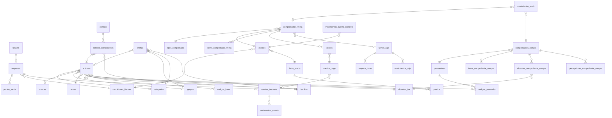

> Parte de [10 — Modelo de datos](../10-modelo-de-datos.md) · Diagrama de referencias (resumen)

## Diagrama de referencias (resumen)

```mermaid
erDiagram
    tenants ||--o{ empresas : ""
    empresas ||--o{ puntos_venta : ""
    empresas }o--|| condiciones_fiscales : ""
    clientes }o--|| condiciones_fiscales : ""
    clientes }o--|| listas_precio : ""
    articulos }o--o| categorias : ""
    articulos }o--o| marcas : ""
    articulos }o--o| grupos : ""
    articulos }o--|| areas : ""
    articulos }o--|| alicuotas_iva : ""
    articulos }o--o| familias : ""
    articulos ||--o{ codigos_barra : ""
    articulos ||--o{ codigos_proveedor : ""
    proveedores ||--o{ codigos_proveedor : ""
    articulos ||--o{ precios : ""
    listas_precio ||--o{ precios : ""
    ofertas }o--o| articulos : ""
    ofertas }o--o| grupos : ""
    ofertas }o--o| categorias : ""
    ofertas }o--o| familias : ""
    combos ||--o{ combos_componentes : ""
    combos_componentes }o--o| articulos : ""
    combos_componentes }o--o| familias : ""
    comprobantes_venta }o--|| tipos_comprobante : ""
    comprobantes_venta }o--|| clientes : ""
    comprobantes_venta ||--o{ items_comprobante_venta : ""
    comprobantes_venta ||--o{ cobros : ""
    cobros }o--|| medios_pago : ""
    comprobantes_compra }o--|| proveedores : ""
    comprobantes_compra ||--o{ items_comprobante_compra : ""
    comprobantes_compra ||--o{ alicuotas_comprobante_compra : ""
    comprobantes_compra ||--o{ percepciones_comprobante_compra : ""
    alicuotas_comprobante_compra }o--|| alicuotas_iva : ""
    comprobantes_venta }o--o| turnos_caja : ""
    turnos_caja ||--o{ arqueos_turno : ""
    turnos_caja ||--o{ movimientos_caja : ""
    empresas ||--o{ cuentas_tesoreria : ""
    cuentas_tesoreria ||--o{ movimientos_cuenta : ""
    medios_pago }o--o| cuentas_tesoreria : ""
    movimientos_stock }o--o| comprobantes_venta : ""
    movimientos_stock }o--o| comprobantes_compra : ""
    movimientos_cuenta_corriente }o--|| clientes : ""
```
